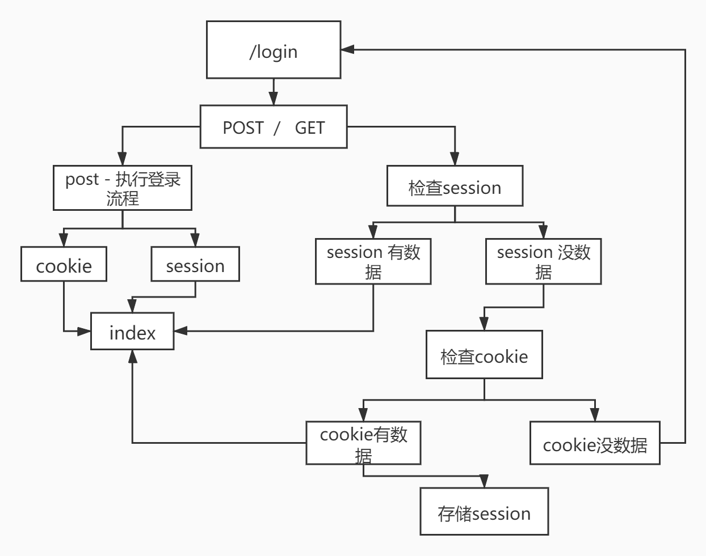

 

# 《Django 项目之网络云笔记》
## 目录
[TOC]

## 网络云笔记项目
- 用户功能:
    1. 注册
    1. 登陆
    1. 退出登陆
- 笔记模块：
    1. 查看笔记列表
    1. 创建新笔记
    1. 修改笔记
    1. 删除笔记
### 数据库设计
- 模型类
    1. 用户模型类
        ```python
        # file : user/models.py
        from django.db import models
        
    	
        # Create your models here.
        class User(models.Model):
            username = models.CharField(verbose_name="用户名", max_length=30, unique=True)
            password = models.CharField(verbose_name="密码", max_length=32)
            created_time = models.DateTimeField(verbose_name="创建时间", auto_now_add=True)
            updated_time = models.DateTimeField(verbose_name="更新时间", auto_now=True)
        
            def __str__(self):
                return 'username %s' % self.username
        
        ```
    2. 笔记模型类
    
    ~~~python
    # note/views.py
    from django.db import models
    from user.models import User
    
    
    # Create your models here.
    class Note(models.Model):
        title = models.CharField(verbose_name='标题', max_length=100)
        content = models.TextField(verbose_name="内容")
        created_time = models.DateTimeField(verbose_name="创建时间", auto_now_add=True)
        updated_time = models.DateTimeField(verbose_name="更新时间", auto_now=True)
        is_active = models.BooleanField(verbose_name="是否删除", default=False)
        user = models.ForeignKey(User, on_delete=models.CASCADE)
    ~~~


### 设计规范
- 登陆设计规范(在user应用中写代码)      
    | 路由正则 | 视图函数 | 模板位置 | 说明 |
    |-|-|-|-|
    | /user/login | login_view | templates/user/login.html | 登陆 |
    | /user/reg | reg_view | templates/user/register.html| 注册 |
    | /user/logout  | logout_view | 无 | 退出 |

- 主页设计规范(在index应用中写代码)
    | 路由正则 | 视图函数 | 模板位置 | 说明 |
    |-|-|-|-|
    | /index/ | index_view | templates/index/index.html | 主页 |

- 云笔记设计规范
    | 路由正则 | 视图函数 | 模板位置 | 说明 |
    |-|-|-|-|
    | /note/all | list_view | templates/note/list_note.html | 显示笔记列表功能 |
    | /note/add | add_view | templates/note/add_note.html| 添加云笔记 |
    | /note/mod/(\d+)  | mod_view | templates/note/mod_note.html | 修改之前云笔记 |
    | /note/del/(\d+) | del_view | 无(返回列表页) | 删除云笔记|
    | /note/(\d+) | show_view | templates/note/note.html | 查看单个笔记 |
- **对笔记的操作需要在登录的状态下，才可以操作的。如何做这种登录的检查？**

通常情况下，我们已经在session记录了用户的登录状态。但是，考虑到session只是一张数据表，不会保存太多数据，这就要求session中的数据有效期短一点。

现在如果用户选择了记住我，意味着用户希望将登录状态保存的时间长一点，所以，选择将登录状态保存到cookies中。

- **检查登录状态时？优先检查谁？cookies还是session？**



**优先检查session**，因为session一定会保存登录状态。而cookies是否保存登录状态取决于用户是否选择了"记住我"。

如果cookies中有登录状态，而session没有，这时，你要注意需要将cookies中的数据**回写session**。

- 用户功能完成后，对笔记的增删改查操作，都需要**用户处于登录状态**。换句话说，在实现对笔记的增删改查的视图函数时，都需要做登录状态的检查。

**用装饰器**

```python
# file : /note/views.py
def check_login(fn):
    def wrap(request, *args, **kwargs):
        # 校验用户是否登录
        if 'username' not in request.session or 'uid' not in request.session:
            # 检查　cookies
            c_username = request.COOKIES.get('username')
            c_uid = request.COOKIES.get('uid')
            if not c_username or not c_uid:
                return HttpResponseRedirect('/user/login')
            else:
                # 回写　session
                request.session['username'] = c_username
                request.session['uid'] = c_uid
        return fn(request, *args, **kwargs)

    return wrap
```


